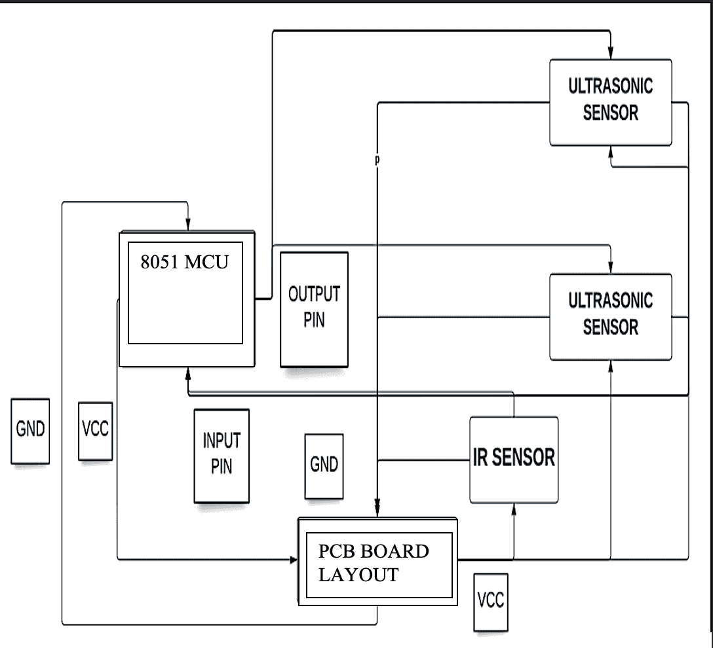
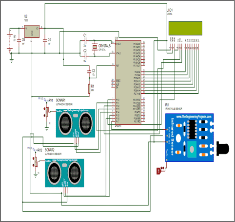
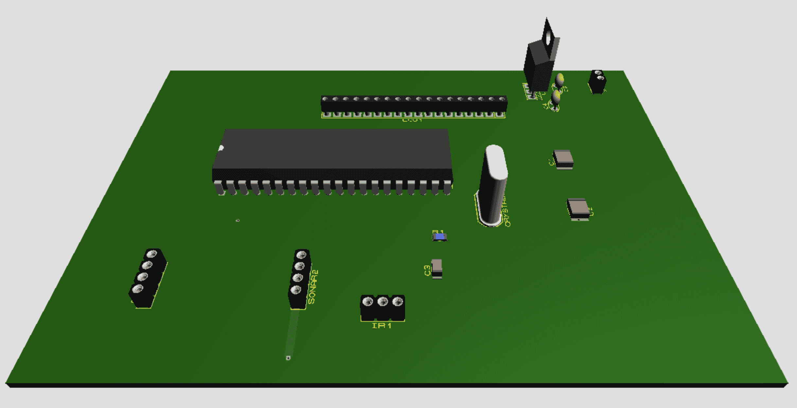
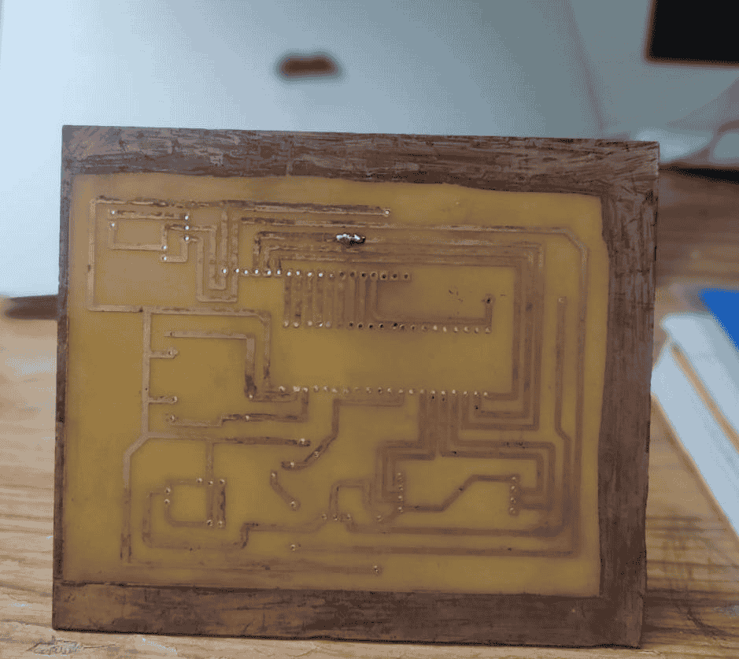
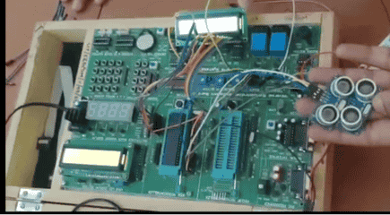
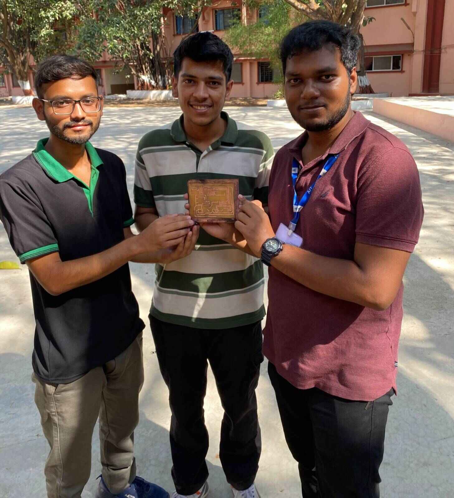

# Smart Parking System using 8051

A smart and efficient parking management system built using 8051 microcontroller to automate parking space allocation and management. The system helps drivers find available parking spots quickly, reducing time wastage and traffic congestion.

Working video- https://youtu.be/cn8MsmLzOQQ

## Technical Implementation

### Core Components
- 8051 Microcontroller
- IR Sensors for vehicle detection
- Ultrasonic Sensors for vehicle size measurement
- LCD Display for user interface
- Custom PCB design for system integration

### System Architecture



The system operates in two main sections:
1. **Entrance Management**
    - IR sensors detect incoming vehicles
    - System checks for vacancy
    - Display shows availability status

2. **Space Allocation**
    - Ultrasonic sensors measure vehicle dimensions
    - System suggests optimal parking spot
    - Real-time vacancy updates

### Key Features
- Real-time parking space monitoring
- Vehicle size detection and optimal spot allocation
- LCD display for driver guidance
- Automated entrance management
- Scalable design for multiple parking spots
- Low maintenance and long service life

## Technical Details

### Hardware Integration
```c
// Sample code snippet showing sensor integration
void ultrasonic1() {
    send_pulse1();
    while(!echo1);
    TH0 = 0x00;
    TL0 = 0x00;
    TR0 = 1;
    while(echo1);
    TR0 = 0;
}
```

### Implementation Highlights
- Custom PCB design for robust operation
- Integrated sensor network for accurate detection
- Real-time processing of sensor data
- Efficient memory utilization
- Modular code structure for easy maintenance

#### Circuit in Proteus


#### 3D visualisation of Circuit


#### Printed Circuit Board



#### Demo in Trainer Kit


## Technologies Used

- Embedded Systems (8051 Architecture)
- C Programming
- PCB Design
- Sensor Integration
- LCD Interface Programming
- Real-time Systems

## Team Behind it



